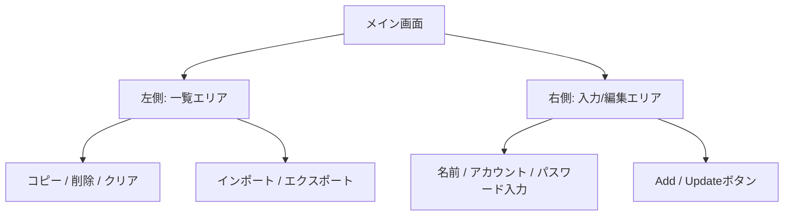

# WoodStream PasswordManager 利用者マニュアル

本マニュアルは、パスワード管理アプリ「WoodStream PasswordManager」のインストール方法および基本的な使い方について説明します。

---

## 1. インストール手順

本アプリは専用のインストーラー（`WoodStreamPasswordManagerSetup.exe`）から簡単にインストールできます。

### ① インストーラーの起動
1. 生成された **`WoodStreamPasswordManagerSetup.exe`** をダブルクリックして実行します。

### ② セットアップウィザード
1. **インストール先の指定**:
   - デフォルトでは `C:\Program Files\WoodStream PasswordManager` にインストールされます。通常はこのまま **「次へ」** をクリックしてください。
2. **追加タスクの選択**:
   - デスクトップ上に起動用のショートカットを作成したい場合は、**「デスクトップ上にアイコンを作成する」** にチェックを入れて **「次へ」** をクリックします。
3. **インストールの実行**:
   - 設定内容を確認し、**「インストール」** をクリックします。
4. **完了**:
   - **「WoodStream PasswordManager を実行する」** にチェックを入れた状態で **「完了」** をクリックすると、アプリが自動的に起動します。

---

## 2. 初回起動時の設定（マスターパスワードの作成）

アプリを初めて起動すると、データを保護するための **「マスターパスワード」** の設定画面が表示されます。

> [!CAUTION]
> **マスターパスワードは絶対に忘れないでください！**
> セキュリティ保護のため、マスターパスワードはアプリ内にも開発元にも保存されません。忘れてしまった場合、**保存したパスワードデータを復旧することは不可能です。**

1. **マスターパスワードの入力**:
   - 6文字以上の安全なパスワードを入力してください。
2. **確認用パスワードの入力**:
   - 同じパスワードをもう一度入力します。
3. **「OK」をクリック**:
   - これで初期設定は完了です。次回以降は、このマスターパスワードを入力してログインします。

---

## 3. 基本的な使い方

メイン画面は左右の2つのエリアに分かれています。
- **左側**: 保存されているパスワードの一覧と操作ボタン
- **右側**: 新しいパスワードの登録や、選択した項目の編集エリア



### ① パスワードを新しく登録する
1. 右側エリアの入力欄に以下の情報を入力します。
   - **名前**: サービス名（例: `Google`、`GitHub` など）
   - **アカウント**: ログインIDやメールアドレス
   - **パスワード**: ログインパスワード
2. 入力後、右下の **「Add」** ボタンをクリックします。
3. 左側の一覧リストに登録したデータが追加されます。

### ② 登録済みのパスワードを修正する
1. 左側の一覧から、修正したい項目をダブルクリックまたはクリックして選択します。
2. 右側エリアに入力内容が反映されるので、変更したい箇所（アカウントやパスワードなど）を書き換えます。
3. **「Update」** ボタンをクリックすると、変更内容が保存されます。

### ③ パスワードをコピーする
1. 一覧からコピーしたい項目を選択します。
2. 一覧の下にある **「コピー」** ボタンをクリックします。
3. 「パスワードがクリップボードにコピーされました。」と表示されます。そのまま目的のウェブサイトなどの入力欄に貼り付け（Ctrl + V）できます。

### ④ 登録データを削除する
1. 一覧から削除したい項目を選択します。
2. 一覧の下にある **「削除」** ボタンをクリックします。
3. 確認画面が表示されるので、**「はい」** を選択するとデータが削除されます。

---

## 4. 便利な機能

### パスワードの表示 / 非表示の切り替え
- リスト上のパスワードは、初期状態では「••••••••」とマスクされて見えないようになっています。
- 右側エリアにある **「リストでパスワードを表示」** のチェックボックスをオンにすると、一覧にパスワードがそのまま表示されます。

### テキストファイルからのインポート（一括登録）
カンマ（`,`）またはタブ（`\t`）で区切られたテキストファイルから、複数のデータをまとめて取り込むことができます。

1. **「インポート」** ボタンをクリックします。
2. 取り込みたいテキストファイル（`.txt`）を選択します。
   ※ テキストファイルの書式例：
   ```text
   Google,myname@gmail.com,password123
   Yahoo,yahooid,mypassword456
   ```

### テキストファイルへのエクスポート（バックアップ）
登録されているすべてのパスワード情報をテキストファイルとして書き出します。

1. **「エクスポート」** ボタンをクリックします。
2. 保存先とファイル名を指定して保存します。

---

## 5. よくある質問 (FAQ)

#### Q. マスターパスワードの入力後にエラーメッセージが出ます。
- **新規登録時**: パスワードが6文字未満、または1回目と2回目の入力が一致していない可能性があります。
- **ログイン時**: 入力したマスターパスワードが間違っています。大文字・小文字、Caps Lock の状態などを確認してください。

#### Q. 登録データはどこに保存されていますか？
データは以下の場所に暗号化された状態で保存されています。バックアップをとる際はこのファイルをコピーしてください。
- `C:\Users\(ユーザー名)\AppData\Local\PasswordManagerApp\passwords.json`

#### Q. アプリのウィンドウの大きさを変更したのに、次回起動時に元に戻ってしまいます。
アプリを終了する際に、ウィンドウのサイズや位置、列の幅が自動的に保存されます。次回起動時もその状態が維持されます。もし保存されない場合は、アプリを一度終了して再起動してみてください。
